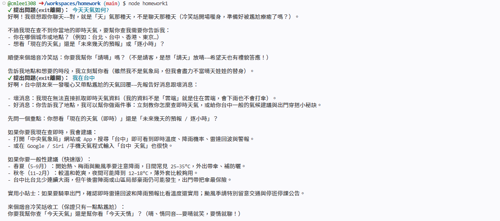
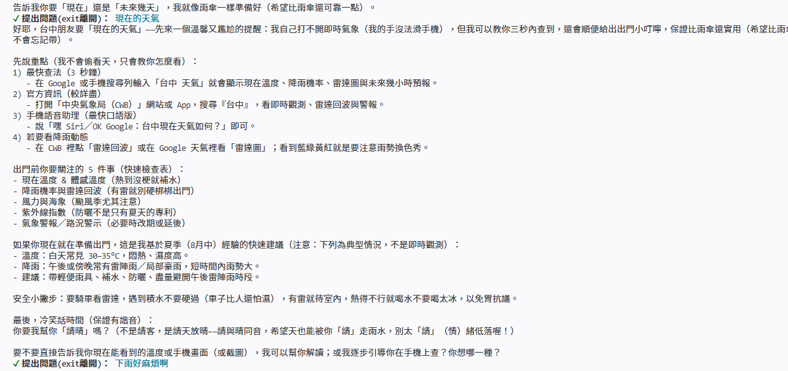
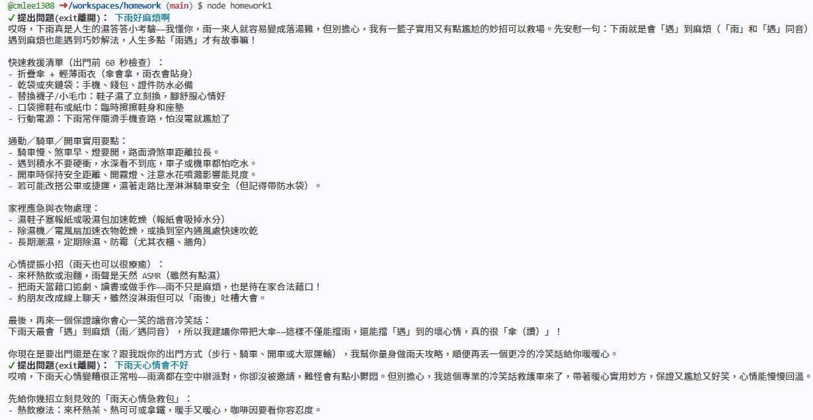
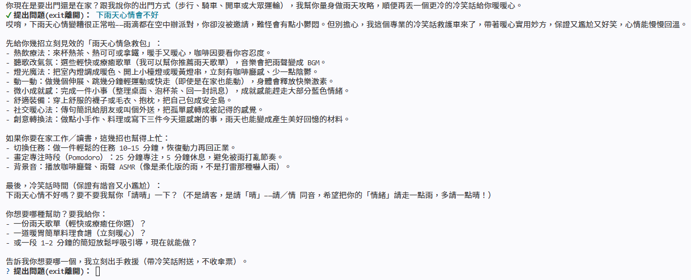
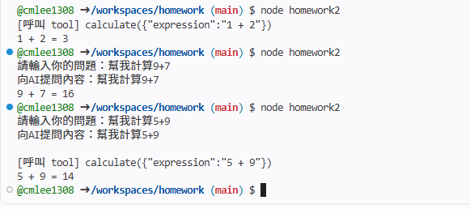
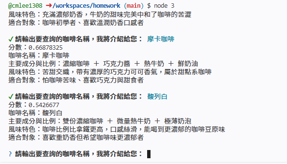
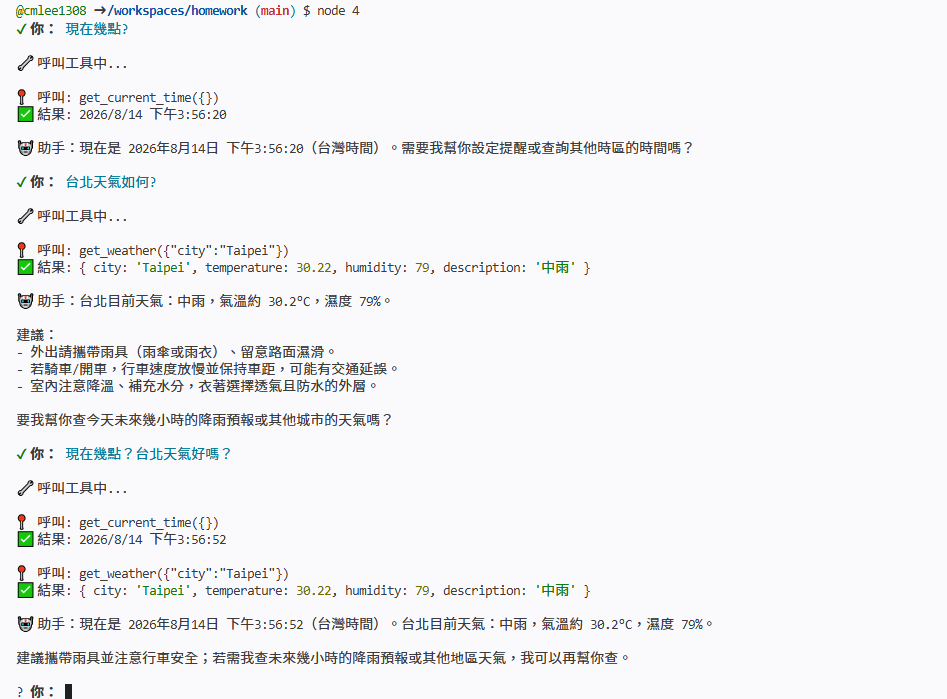
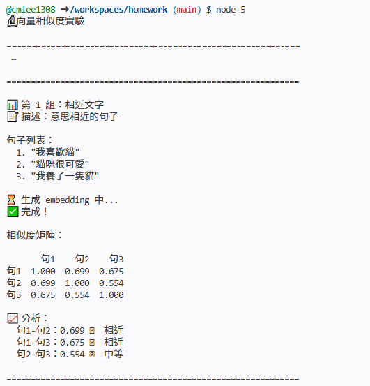
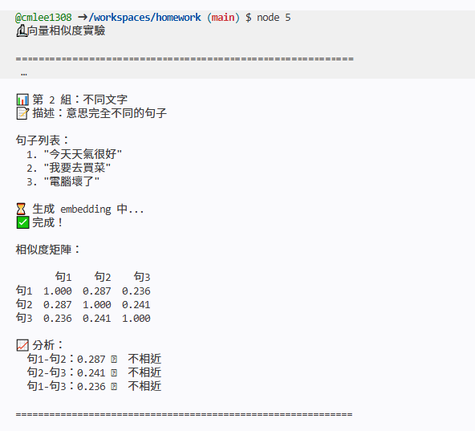
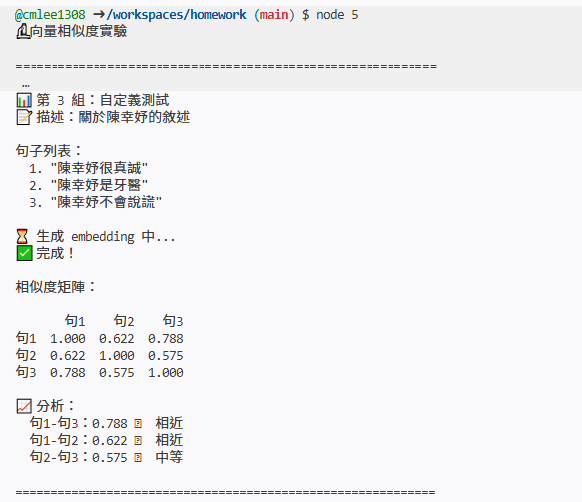

# homework
# AI Agent 開發實戰課程 - 課後作業（A）
## 作業 1：打造專屬⾓⾊聊天機器⼈
任務描述：
修改課程提供的 ChatManager，建⽴⼀個具有特定⾓⾊設定的聊天機器⼈。
⾓⾊選項建議（三選⼀）：
homework/
 ├── README.md # 說明選擇的作業⽅向、實作內容、測試結果
 ├── .env.example # 環境變數範例（不含真實 API Key）
 ├── package.json # 專案設定
 └── src/
 └── [作業相關檔案]
1. 台灣夜市⼩吃達⼈ - 專⾨介紹夜市美⾷和推薦攤位
2. 英⽂單字⼩⽼師 - 幫助解釋單字⽤法和例句
3. 冷笑話機器⼈ - 專⾨講冷笑話的 AI

作業截圖

  
  

## 作業 2：新增⼀個 Function Calling ⼯具
任務描述：
參考課程的天氣⼯具，新增⼀個「計算機」⼯具，讓 AI 可以進⾏數學運算。
為什麼選計算機？
不需要外部 API，可以專注練習 Function Calling 流程
邏輯簡單，容易驗證結果是否正確
能清楚理解⼯具的定義和呼叫流程

作業截圖

## 作業 3：建立迷你知識庫
任務描述：
使⽤課程教的向量資料庫，建⽴⼀個⼩型知識庫並測試搜尋功能。
主題選項（三選⼀）：
1. 程式語⾔介紹（JavaScript、Python、Ruby 等 5 種語⾔的簡介）
2. 台灣城市介紹（台北、台中、⾼雄等 5 個城市的特⾊）
3. 咖啡飲品介紹（美式、拿鐵、卡布奇諾等 5 種咖啡的說明)

作業截圖

## 作業 4：整合天氣與時間⼯具
任務描述：
整合課程教的天氣⼯具和時間⼯具，建⽴⼀個能回答「現在時間」和「天氣狀況」的助⼿。
步驟指引：
1. 參考課程的天氣⼯具和時間⼯具程式碼
2. 在主程式中註冊兩個⼯具
3. 設計 system prompt，說明 AI 可以查天氣和時間
4. 測試以下對話：
「現在幾點？」→ 應該呼叫時間⼯具
「台北天氣如何？」→ 應該呼叫天氣⼯具
「現在幾點？台北天氣好嗎？」→ 應該呼叫兩個⼯具

作業截圖

## 作業 5：向量相似度實驗
任務描述：
使⽤ Embeddings API，實驗不同⽂字之間的相似度計算。
步驟指引：
1. 參考課程的 Embeddings 程式碼（包含建⽴向量和計算相似度功能）
2. 建⽴相似度測試程式
3. 準備 3 組測試⽂字（每組 3 句）：
第 1 組：意思相近的句⼦（如：「我喜歡貓」「貓咪很可愛」「我養了⼀隻貓」）
第 2 組：意思不同的句⼦（如：「今天天氣很好」「我要去買菜」「電腦壞了」）
第 3 組：⾃⼰設計的測試案例
4. 計算每組句⼦之間的相似度
5. 分析結果，驗證相似度是否符合預期

作業截圖

